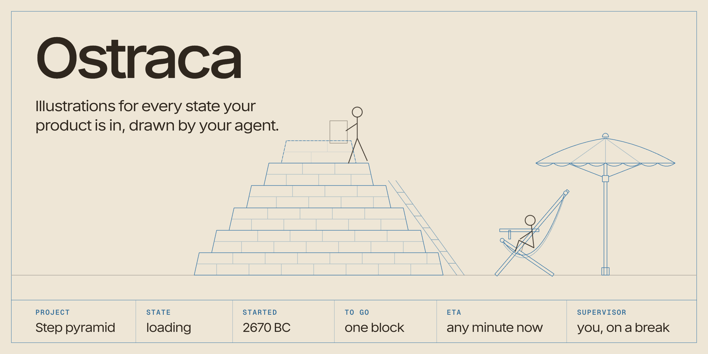
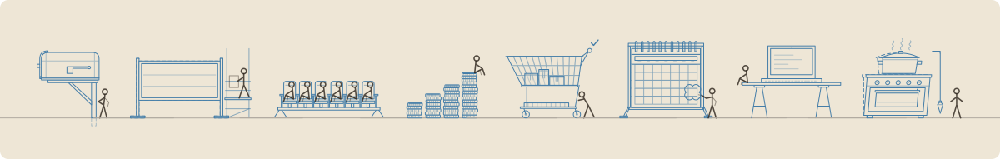

# Ostraca

<picture>
  <source media="(prefers-color-scheme: dark)" srcset=".github/cover-dark.png">
  
</picture>

Illustrations for every state your product is in, drawn by your agent.

Ostraca is a skill for coding agents and the engine it draws with. Name any object and your agent draws it as a small building elevation in blueprint blue that follows your product through its states: set out while it is empty, rising while it loads, signed off when it is done, revised when it changes, out of true when something goes wrong. Ask for all six states or only the ones you need, as a figure for your app or as one SVG picture. 34 ready-drawn figures come with it, to use as they are and to start from.

[ostraca.ahmedamr.com](https://ostraca.ahmedamr.com). MIT licensed. No runtime dependencies. Works with or without React.

Ostraca are the limestone flakes Egyptian tomb builders sketched on.

## Draw any object

```sh
npx skills add ahmedamr-r/ostraca
```

Then ask your agent for an illustration, for an empty state, an upload screen, a 404 or anything else in your product. Or call the skill by name:

```
/ostraca coffee cup
```

Before it draws, the agent asks what you need, in one message, with a default for each. Say "the defaults" and it draws all six states as a figure.

| Option | Choices | Default |
| --- | --- | --- |
| States | All six, or any of `idle`, `empty`, `loading`, `success`, `changed` and `error` | All six |
| Output | A figure for your app, or one standalone SVG picture | A figure |
| For a picture | Light, dark or both; the workers on or off; the paper behind it or transparent; the library's colours or your own | Both, off, transparent, the library's |

Anything your request already says, it does not ask again: `/ostraca coffee cup, empty only`, or `/ostraca a coffee cup for our empty orders page, as an svg`. Name a moment instead of an object, such as `/ostraca something for a fitness app`, and it offers two or three objects to pick from.

Then it writes one description file, checks it against the library's rules, draws contact sheets in light and dark, looks at them and fixes what it sees. A figure goes into your app with `define()` and works everywhere a ready-drawn one does:

```js
import { define } from "ostraca";
import cup from "./coffee-cup.js";

define(cup);
```

A picture is an SVG file with every colour written on it, for a design file, a slide, an email or an ``. The skill works in any agent that reads `SKILL.md` skills, such as Claude Code, and its checks need Node 22 and Google Chrome or Chromium. See [docs/skill.md](docs/skill.md).

## Install the engine

```sh
npm i ostraca
```

## React

```jsx
import { Ostraca } from "ostraca/react";
import "ostraca/styles.css";

export function Upload({ sent, total, failed, done }) {
  const state = failed ? "error" : done ? "success" : total ? "loading" : "empty";
  return <Ostraca name="ramp" state={state} value={total ? sent / total : undefined} />;
}
```

It renders on the server. When a prop changes in the browser, the drawing animates to the new state.

## HTML

```js
import { render, mount } from "ostraca";
import "ostraca/styles.css";

// a string, anywhere
document.querySelector("#inbox-art").innerHTML = render("inbox", { state: "empty" });

// or kept, so changes animate
const art = mount(document.querySelector("#sync-art"), "bridge", { state: "loading" });
art.update({ state: "success" });
```

## Six states

| State | Your product | The drawing |
| --- | --- | --- |
| `idle` | Nothing to report | Built: drawn solid |
| `empty` | Nothing here yet | Set out: a dashed outline where it will stand |
| `loading` | Working on it | Rising: inks from the ground up under a scaffold or ladder. Pass `value` from 0 to 1, or leave it out and a gin wheel bucket goes up and down |
| `success` | Done | Signed off: the scaffold comes down and a tick draws on |
| `changed` | Something new | Revised: a revision cloud round one part, with your real version in a triangle (`rev`) |
| `error` | Something went wrong | Out of true: it leans off a plumb line, or sags under a taut string |

Every ready-drawn figure draws all six. A figure drawn with the skill can draw only the ones you asked for.

## Figures

<picture>
  <source media="(prefers-color-scheme: dark)" srcset="docs/images/street-dark.svg">
  
</picture>

34 ready-drawn subjects on eight shelves, to use as they are: messages, files, people, money, shopping, time, devices, and the building site the library started from. See them all, in any state, on [the site](https://ostraca.ahmedamr.com/figures). The full list, with what each one is for, is in [docs/options.md](docs/options.md#figures).

```js
import { figures } from "ostraca";
```

## Options

| Option | Default | |
| --- | --- | --- |
| `state` | `"idle"` | One of the six |
| `value` | none | 0 to 1 for `loading` |
| `rev` | none | The app's version, for `changed` |
| `figure` | `null` | `{ value, unit }`, a real measure for figures that draw one |
| `crew` | `false` | Puts the workers on site |
| `lettered` | none | A short word in the drawn pen |
| `title` | title and state | The accessible name |
| `decorative` | `false` | Hides it from assistive tech |
| `dir` | `"ltr"` | `"rtl"` mirrors the drawing |
| `color` | `--ostraca-thing` | Any CSS colour for the drawing |
| `crewColor` | `--ostraca-crew` | Any CSS colour for the workers |
| `paperColor` | `--ostraca-paper` | Any CSS colour for the paper under it |

```jsx
<Ostraca name="inbox" state="empty" color="var(--accent)" crewColor="var(--text)" paperColor="var(--surface)" />
```

## Docs

On [the site](https://ostraca.ahmedamr.com/docs), or here:

- [Start](docs/index.md)
- [Agent skill](docs/skill.md): the options it asks for, fewer states, standalone pictures
- [Usage](docs/usage.md): HTML, React, server rendering, static SVG, Figma
- [States](docs/states.md)
- [Options and figures](docs/options.md)
- [Theming](docs/theming.md): colours, as tokens or as options, and dark mode
- [Workers](docs/workers.md)
- [Accessibility](docs/accessibility.md)

## Licence

MIT, so the drawings can go in anything you make, commercial or not. See [LICENSE](LICENSE).

Made in Cairo by [Ahmed Amr](https://ahmedamr.com). [@ahmedamrr_r](https://x.com/ahmedamrr_r) on X.
